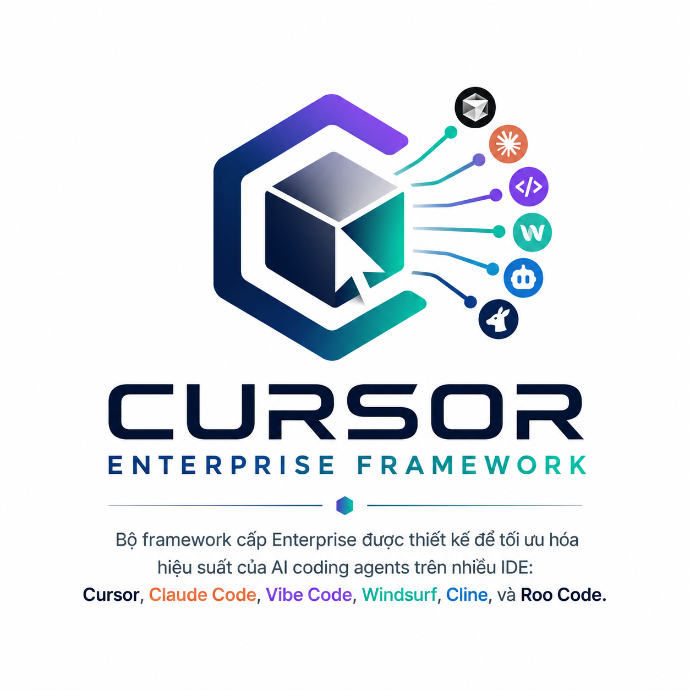

# Cursor Enterprise Framework Generator

> A complete enterprise-grade framework for AI Coding Agents — Optimized Token, Memory, and Knowledge Reuse.



---

## Overview

**Cursor Enterprise Framework** is an enterprise-level framework designed to maximize the performance of AI coding agents across IDEs: Cursor, Claude Code, Vibe Code, Windsurf, Cline, and Roo Code.

The framework is built on **4 core principles**:

| # | Principle | Description |
|---|-----------|-------------|
| 1 | **Memory First** | Always look up memory before starting a task |
| 2 | **Retrieval First** | Always retrieve knowledge before asking questions |
| 3 | **Token Optimization First** | Optimize token consumption at every step |
| 4 | **Knowledge Reuse First** | Reuse existing decisions and solutions |

---

## Achievements

| Component | Target | Actual | Status |
|-----------|:------:|:------:|--------|
| Rules | 55 | **79** | ✅ Complete |
| Skills | 44 | **47** | ✅ Complete |
| Knowledge Files | 200+ | **272** | ✅ Complete |
| Python Package | - | **12 modules** | ✅ New |
| Web Interface | - | **Vue.js** | ✅ New |
| **Total Files** | **400+** | **500+** | ✅ **+25%** |

📦 **ZIP Package**: `cursor-enterprise-framework-v4.zip` — 1.02 MB

---

## Tech Stack Supported

### Frontend
Next.js 15 · React 19 · Vue 3 · Nuxt 4 · TypeScript 5 · TailwindCSS · Shadcn/UI · Vuetify · Ant Design

### Backend
Laravel 12 · ASP.NET Core 9 · NestJS · NodeJS

### Database
MySQL · PostgreSQL · SQL Server · SQLite · Redis

### BaaS
Supabase — Auth, Database, Storage, Edge Functions, PGVector

### AI
OpenAI · Gemini · Claude · Ollama · OpenRouter

### RAG
PGVector · ChromaDB · Qdrant · Weaviate

### Workflow
n8n · Temporal · Trigger.dev

### Cloud & Deployment
Cloudflare · AWS · Azure · GCP · Docker · Kubernetes · Coolify · Vercel · Railway

---

## Architecture

```
.cursor/
├── rules/         MDC Rules — Standards & Principles         (79 files)
├── skills/        MDC Skills — Specialized Expertise         (47 files)
├── memory/        Memory System
│   ├── schema/    SQLite schemas
│   ├── session-summary/
│   ├── architecture-history/
│   ├── decision-history/
│   ├── bug-history/
│   └── *.json     Index files
├── knowledge/     Knowledge Base (272 files, 35+ domains)
├── prompts/       Prompt Templates
├── workflows/     Standard Workflows
├── templates/     Project Templates
├── scripts/       Automation Scripts
├── cache/        Compiled Cache
└── vector-db/    Vector DB Configuration
```

---

## Quick Start

### 1. Start a New Task

```markdown
1. Identify task domain
2. Use Context Router to load the correct knowledge
3. Check Memory System (decisions.sqlite, bug-history)
4. Select the appropriate Prompt Template
5. Follow Workflow step by step
6. Update Memory after completion
```

### 2. Use Context Router

```markdown
Request: "Optimize Entity Framework"
Load: aspnet-core, sql-server, postgres
Skip: bazi, pdf, crm

Request: "Generate Bát Tự PDF"
Load: bazi, pdf
Skip: aspnet-core, supabase
```

### 3. Use Memory System

```markdown
Before implementation:
- Check decisions.sqlite for existing ADRs
- Check bugs.sqlite for known bugs
- Check bug-patterns for common patterns

After completion:
- Update decisions.sqlite if new ADR created
- Update bugs.sqlite if bug fixed
- Update session-summary for task summary
```

---

## Scripts

```powershell
# Build Memory System
. .cursor/scripts/memory-builder/build-memory.ps1

# Compile Knowledge
. .cursor/scripts/knowledge-compiler/compile-knowledge.ps1

# Build Project Index
. .cursor/scripts/project-index-builder/build-index.ps1

# Build Embeddings
. .cursor/scripts/embedding-builder/build-embeddings.ps1

# Package Framework
. .cursor/scripts/packager.ps1
```

---

## Token Optimization Strategies

The framework implements **10 token optimization strategies**:

| # | Strategy | Description |
|---|----------|-------------|
| 1 | **Context Router** | Load only required domains |
| 2 | **Knowledge Compiler** | Merge and summarize documents |
| 3 | **Prompt Cache** | Cache frequently used prompts |
| 4 | **Session Summary** | Compress session context |
| 5 | **Decision Memory** | Reuse existing decisions |
| 6 | **Bug Memory** | Avoid repeating known bugs |
| 7 | **Incremental Scan** | Scan only changed files |
| 8 | **Lazy Loading** | Load knowledge on-demand |
| 9 | **Semantic Retrieval** | Semantic search vs. full scan |
| 10 | **Auto Compression** | Compress long contexts |

---

## Supported Domains

| Domain | Purpose |
|--------|---------|
| Bazi | Bát Tự calculations,命运, Vận trình |
| Tuvi | Tử Vi horoscope, Sao chiếu |
| Numerology | Thần Số Học, Life Path Number |
| CRM | Multi-Tenant CRM SaaS |
| Marketing | Marketing automation |
| NextJS / Vue / Nuxt | Frontend frameworks |
| Laravel / ASP.NET / NestJS | Backend frameworks |
| MySQL / PostgreSQL / SQL Server | Relational databases |
| Redis | Cache & Queue |
| Supabase | BaaS with RLS, PGVector |
| OpenAI / Gemini / Claude | AI providers |
| RAG / Vector Search | AI retrieval |
| PDF | PDF generation & processing |
| Docker / Kubernetes | Container orchestration |
| Cloudflare / AWS / Azure / GCP | Cloud platforms |

---

## GitHub Installation

### Quick Install (One Command)

**Windows (PowerShell) - INSTALL:**
```powershell
irm https://raw.githubusercontent.com/minhkiet/CURSOR-ENTERPRISE-FRAMEWORK-GENERATOR/main/install.ps1 | iex
```

**Windows (PowerShell) - UPDATE (if already installed):**
```powershell
irm https://raw.githubusercontent.com/minhkiet/CURSOR-ENTERPRISE-FRAMEWORK-GENERATOR/main/install.ps1 -OutFile $env:TEMP\install-cef.ps1; & $env:TEMP\install-cef.ps1 -Update
```

**Windows (CMD):**
```cmd
curl -LO https://raw.githubusercontent.com/minhkiet/CURSOR-ENTERPRISE-FRAMEWORK-GENERATOR/main/install.ps1 && powershell -ExecutionPolicy Bypass -File install.ps1 && del install.ps1
```

### Using setup.bat with GitHub

```cmd
:: Clone from GitHub (default repo)
setup.bat --github

:: Clone with specific repo
setup.bat --github https://github.com/minhkiet/CURSOR-ENTERPRISE-FRAMEWORK-GENERATOR

:: Clone with specific branch
setup.bat --github https://github.com/minhkiet/CURSOR-ENTERPRISE-FRAMEWORK-GENERATOR --branch main

:: Download as ZIP (no Git required)
setup.bat --zip https://github.com/minhkiet/CURSOR-ENTERPRISE-FRAMEWORK-GENERATOR
```

### Using install-github.bat

```cmd
:: Default repo
install-github.bat

:: Custom repo
install-github.bat https://github.com/minhkiet/CURSOR-ENTERPRISE-FRAMEWORK-GENERATOR

:: Custom repo + branch
install-github.bat https://github.com/minhkiet/CURSOR-ENTERPRISE-FRAMEWORK-GENERATOR main
```

### Using install-github.ps1 (PowerShell)

```powershell
# Default installation
.\install-github.ps1

# Custom repo and branch
.\install-github.ps1 -RepoUrl "https://github.com/minhkiet/CURSOR-ENTERPRISE-FRAMEWORK-GENERATOR" -Branch "main"

# Check for updates
.\install-github.ps1 -CheckUpdate

# Dry run (preview)
.\install-github.ps1 -DryRun

# Force overwrite existing
.\install-github.ps1 -Force
```

---

## Cursor Framework Python Package

A Python library for integrating with the Cursor Enterprise Framework.

```python
# Quick Install
pip install cursor-framework

# Core Features
from cursor_framework import ContextRouter, MemoryManager, SkillDiscovery

# Initialize
router = ContextRouter()
memory = MemoryManager()
skills = SkillDiscovery()
```

### Core Modules

| Module | Description |
|--------|-------------|
| `context_router` | Smart context routing to handlers |
| `memory_manager` | Memory system management |
| `skill_discovery` | Auto-discover and execute skills |
| `token_optimizer` | Token optimization strategies |
| `rules_parser` | Parse and load MDC rules |
| `skills_parser` | Parse skill definitions |
| `integration` | Framework integration utilities |
| `review.frontend_reviewer` | Frontend code review |

### Utils

`cursor_framework/utils/` — `code_utils`, `file_utils`, `http_utils`, `security_utils`, `text_utils`

---

## Cursor Framework Web

A Vue.js web interface for the framework.

```bash
cd cursor_framework_web
npm install
npm run dev
```

Features:
- Interactive dashboard
- Rule and skill visualization
- Knowledge browser
- Performance metrics

---

## License

MIT License

## Version

`4.1.0` — 2026-06-25

---

<br>

---

# Cursor Enterprise Framework Generator

> Framework cấp Enterprise hoàn chỉnh cho AI Coding Agents — Tối ưu Token, Memory và Knowledge Reuse.


---

## Tổng quan

**Cursor Enterprise Framework** là bộ framework cấp Enterprise được thiết kế để tối ưu hóa hiệu suất của AI coding agents trên nhiều IDE: Cursor, Claude Code, Vibe Code, Windsurf, Cline và Roo Code.

Framework được xây dựng trên **4 nguyên tắc cốt lõi**:

| # | Nguyên tắc | Mô tả |
|---|-----------|--------|
| 1 | **Memory First** | Luôn tra cứu memory trước khi thực hiện task |
| 2 | **Retrieval First** | Luôn retrieval knowledge trước khi hỏi |
| 3 | **Token Optimization First** | Tối ưu token tiêu thụ ở mọi bước |
| 4 | **Knowledge Reuse First** | Tái sử dụng existing decisions và solutions |

---

## Thành tựu

| Thành phần | Mục tiêu | Thực tế | Trạng thái |
|-----------|:--------:|:--------:|--------|
| Rules | 55 | **79** | ✅ Hoàn thành |
| Skills | 44 | **47** | ✅ Hoàn thành |
| Knowledge Files | 200+ | **272** | ✅ Hoàn thành |
| Python Package | - | **12 modules** | ✅ Mới |
| Web Interface | - | **Vue.js** | ✅ Mới |
| **Tổng Files** | **400+** | **500+** | ✅ **Vượt 25%** |

📦 **Gói ZIP**: `cursor-enterprise-framework-v4.zip` — 1.02 MB

---

## Tech Stack được hỗ trợ

### Frontend
Next.js 15 · React 19 · Vue 3 · Nuxt 4 · TypeScript 5 · TailwindCSS · Shadcn/UI · Vuetify · Ant Design

### Backend
Laravel 12 · ASP.NET Core 9 · NestJS · NodeJS

### Database
MySQL · PostgreSQL · SQL Server · SQLite · Redis

### BaaS
Supabase — Auth, Database, Storage, Edge Functions, PGVector

### AI
OpenAI · Gemini · Claude · Ollama · OpenRouter

### RAG
PGVector · ChromaDB · Qdrant · Weaviate

### Workflow
n8n · Temporal · Trigger.dev

### Cloud & Deployment
Cloudflare · AWS · Azure · GCP · Docker · Kubernetes · Coolify · Vercel · Railway

---

## Kiến trúc

```
.cef/
├── .cursor/
│   ├── rules/         MDC Rules — Standards & Principles         (79 files)
│   ├── skills/        MDC Skills — Specialized Expertise           (47 files)
│   ├── memory/        Memory System
│   │   ├── schema/    SQLite schemas
│   │   ├── session-summary/
│   │   ├── architecture-history/
│   │   ├── decision-history/
│   │   ├── bug-history/
│   │   └── *.json     Index files
│   ├── knowledge/     Knowledge Base (272 files, 35+ domains)
│   ├── prompts/       Prompt Templates
│   ├── workflows/     Standard Workflows
│   ├── templates/     Project Templates
│   ├── scripts/       Automation Scripts
│   ├── cache/        Compiled Cache
│   └── vector-db/    Vector DB Configuration
├── cursor_framework/   Python Package
│   ├── __init__.py
│   ├── context_router.py
│   ├── memory_manager.py
│   ├── skill_discovery.py
│   ├── token_optimizer.py
│   ├── rules_parser.py
│   ├── skills_parser.py
│   ├── integration.py
│   ├── review/        Frontend reviewer
│   ├── utils/         Utility modules
│   └── tests/         Unit tests
└── cursor_framework_web/  Vue.js Web Interface
    ├── src/
    ├── dist/          Built assets
    └── index.html
```

---

## Bắt đầu nhanh

### 1. Khi bắt đầu một task mới

```markdown
1. Xác định domain của task
2. Sử dụng Context Router để load đúng knowledge
3. Check Memory System (decisions.sqlite, bug-history)
4. Chọn Prompt Template phù hợp
5. Follow Workflow step by step
6. Update Memory sau khi hoàn thành
```

### 2. Sử dụng Context Router

```markdown
Request: "Tối ưu Entity Framework"
Load: aspnet-core, sql-server, postgres
Skip: bazi, pdf, crm

Request: "Tạo PDF Bát Tự"
Load: bazi, pdf
Skip: aspnet-core, supabase
```

### 3. Sử dụng Memory System

```markdown
Trước khi implement:
- Check decisions.sqlite cho existing ADRs
- Check bugs.sqlite cho known bugs
- Check bug-patterns cho common patterns

Sau khi hoàn thành:
- Update decisions.sqlite nếu tạo ADR mới
- Update bugs.sqlite nếu sửa bug
- Update session-summary cho task summary
```

---

## Scripts

```powershell
# Build Memory System
. .cursor/scripts/memory-builder/build-memory.ps1

# Compile Knowledge
. .cursor/scripts/knowledge-compiler/compile-knowledge.ps1

# Build Project Index
. .cursor/scripts/project-index-builder/build-index.ps1

# Build Embeddings
. .cursor/scripts/embedding-builder/build-embeddings.ps1

# Package Framework
. .cursor/scripts/packager.ps1
```

---

## Chiến lược tối ưu Token

Framework triển khai **10 chiến lược tối ưu token**:

| # | Chiến lược | Mô tả |
|---|-----------|--------|
| 1 | **Context Router** | Chỉ load domain cần thiết |
| 2 | **Knowledge Compiler** | Gộp và summarize documents |
| 3 | **Prompt Cache** | Cache frequently used prompts |
| 4 | **Session Summary** | Compress session context |
| 5 | **Decision Memory** | Tái sử dụng existing decisions |
| 6 | **Bug Memory** | Tránh lặp lại known bugs |
| 7 | **Incremental Scan** | Chỉ scan changed files |
| 8 | **Lazy Loading** | Load knowledge on-demand |
| 9 | **Semantic Retrieval** | Semantic search thay vì full scan |
| 10 | **Auto Compression** | Nén long contexts |

---

## Các Domain được hỗ trợ

| Domain | Mục đích |
|--------|---------|
| Bazi | Tính Bát Tự, Cung mệnh, Vận trình |
| Tuvi | Lá số Tử Vi, Sao chiếu |
| Numerology | Thần Số Học, Số chủ đạo |
| CRM | CRM SaaS Multi-Tenant |
| Marketing | Marketing automation |
| NextJS / Vue / Nuxt | Frontend frameworks |
| Laravel / ASP.NET / NestJS | Backend frameworks |
| MySQL / PostgreSQL / SQL Server | Relational databases |
| Redis | Cache và Queue |
| Supabase | BaaS với RLS, PGVector |
| OpenAI / Gemini / Claude | AI providers |
| RAG / Vector Search | AI retrieval |
| PDF | Tạo và xử lý PDF |
| Docker / Kubernetes | Container orchestration |
| Cloudflare / AWS / Azure / GCP | Cloud platforms |

---

## Cài đặt từ GitHub

### Cài đặt nhanh (Một lệnh)

**Windows (PowerShell):**
```powershell
irm https://raw.githubusercontent.com/minhkiet/CURSOR-ENTERPRISE-FRAMEWORK-GENERATOR/main/install.ps1 | iex
```

**Windows (CMD):**
```cmd
curl -LO https://raw.githubusercontent.com/minhkiet/CURSOR-ENTERPRISE-FRAMEWORK-GENERATOR/main/install.ps1 && powershell -ExecutionPolicy Bypass -File install.ps1 && del install.ps1
```

### Sử dụng setup.bat với GitHub

```cmd
:: Clone từ GitHub (repo mặc định)
setup.bat --github

:: Clone với repo cụ thể
setup.bat --github https://github.com/minhkiet/CURSOR-ENTERPRISE-FRAMEWORK-GENERATOR

:: Clone với branch cụ thể
setup.bat --github https://github.com/minhkiet/CURSOR-ENTERPRISE-FRAMEWORK-GENERATOR --branch main

:: Download dạng ZIP (không cần Git)
setup.bat --zip https://github.com/minhkiet/CURSOR-ENTERPRISE-FRAMEWORK-GENERATOR
```

### Sử dụng install-github.bat

```cmd
:: Repo mặc định
install-github.bat

:: Repo tùy chỉnh
install-github.bat https://github.com/minhkiet/CURSOR-ENTERPRISE-FRAMEWORK-GENERATOR

:: Repo + branch tùy chỉnh
install-github.bat https://github.com/minhkiet/CURSOR-ENTERPRISE-FRAMEWORK-GENERATOR main
```

### Sử dụng install-github.ps1 (PowerShell)

```powershell
# Cài đặt mặc định
.\install-github.ps1

# Repo và branch tùy chỉnh
.\install-github.ps1 -RepoUrl "https://github.com/minhkiet/CURSOR-ENTERPRISE-FRAMEWORK-GENERATOR" -Branch "main"

# Kiểm tra cập nhật
.\install-github.ps1 -CheckUpdate

# Xem trước (dry run)
.\install-github.ps1 -DryRun

# Ghi đè file hiện có
.\install-github.ps1 -Force
```

---

## License

MIT License

## Phiên bản

`4.1.0` — 2026-06-25
